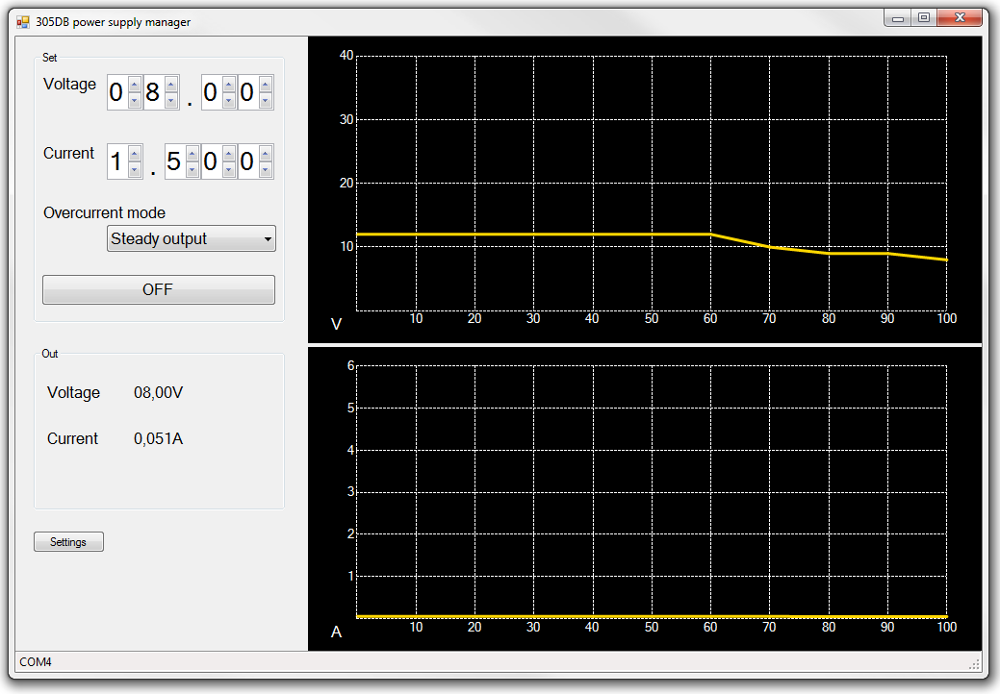

# PowerSupplyManager
Windows GUI manager for YIHUA 305DB (Element 305DB, etc) power supply.

- http://yihua-gz.com/Products_detail.asp?id=467&sortid=264
- http://yihua-soldering.com/profile/download-center.html/158743/0/

Max voltage - 31V, max current - 5A.

## Power supply protocol
Control messages format

### 1. Send message
YHPPSU[voltage][overcurrent][current][output]

- voltage - 4-digit voltage value, e.g. 1510 - 15,10V, 0005 - 0,05V
- overcurrent - 1 symbol overcurrent mode, "H" - steady output, "C" - trip output
- current - 4-digit current value, e.g. 5000 - 5A, 0050 - 0,05A
- output - 1 symbol, enable/disable output, "N" - disabled, "O" - enabled

Note: if current set to 0000 output will be disabled.

Examples:
- YHPPSU0505H5010OY - 5,05V 5,01A output enabled, steady output
- YHPPSU1050C1000OY - 10,5V 1A output disabled, trip output

### 2. Receive message
YHPPSU[voltage]A[current][overcurrent]
- voltage - 4-digit real voltage value, e.g. 1510 - 15,10V, 0005 - 0,05V
- current - 4-digit real current value, e.g. 5000 - 5A, 0050 - 0,05A
- overcurrent - 1 symbol, real overcurrent value, "W" - normal output, "B" - overcurrent happened

## User interface

## Platform

.Net Framework 4.5.

## LICENSE

The software released under the terms of the MIT license.
